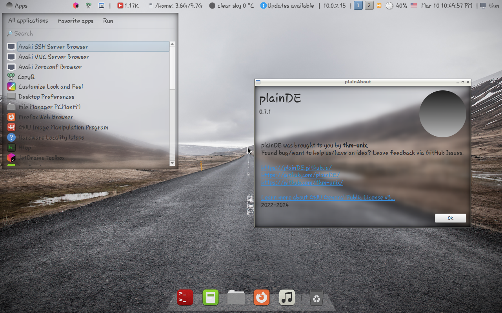

  
  <h1>plainPanel</h1>
  
Lightweight panel for OpenBox, FluxBox, and other window managers.

 
  
  
  
  
  <h2>Applets</h2>
   App Menu,
   Window List,
   Launcher,
   CLI Output,
   Battery, 
   Spacer,
   Worskpaces,
   MPRIS Playback Control,
   Volume,
   SNI tray, 
   Keyboard Layout,
   Date & Time,
   Splitter,
   User menu,
   Local IPv4 Indicator
  
  <h2>Screenshots</h2>
  
  
  <h2>Installation</h2>
  For the installation guide, refer to <a href="https://plainde.github.io/docs.github.io/installation.html">docs</a>.
  
  <h2>Customizing</h2>
  You can either edit ~/.config/plainDE/config.json manually (refer to <a href="https://plainde.github.io/docs.github.io/config.html">docs</a>) or use <a href="https://github.com/plainDE/plainControlCenter">plainControlCenter</a>.
  
  <h2>How can I help you?</h2>
  <ul>
    <li>Develop a new applet</li>
    <li>Translate plainPanel into another language (soon)</li>
    <li>Report a bug</li>
    <li>Fix a bug or suggest solution for it</li>
    <li>Suggest an interesting idea</li>
    <li>...</li>
  </ul>
  
  Any help is appreciated. Use GitHub Issues to send your feedback.

  <h2>Miscellaneous</h2>
  <b>Note</b>. Mint-Y/Mint-L is recommended icon theme (we use a few Mint-Y-only icons). 
  

