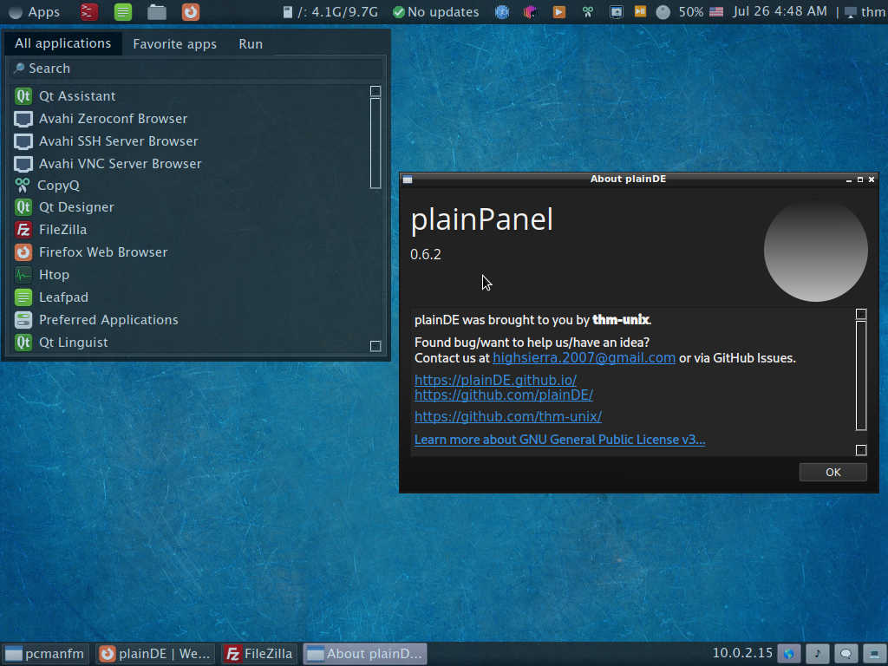

  
  <h1>plainPanel</h1>
  
Lightweight panel for OpenBox, FluxBox and other window managers.

 
  
  
  
  
  <h2>Applets</h2>
   App Menu 
   Window List 
   Launcher 
   CLI Output 
   Battery 
   Spacer 
   Worskpaces 
   MPRIS 
   Volume 
   SNI tray 
   Keyboard Layout 
   Date & Time 
   Splitter 
   User menu 
   Local IPv4 Indicator 
  
  <h2>Screenshots</h2>
  
  
  <h2>Dependencies</h2>
  <code>git</code>, <code>qt5-base</code>, <code>xorg</code>, <code>noto-fonts-emoji</code>, <code>polkit</code>, <code>ttf-opensans</code>, <code>make</code>, <code>alsa-utils</code>, <code>kwindowsystem</code>, <code>python3</code>, <code>xcompmgr</code>, <code>upower</code>
  
  <h2>Installation</h2>
  Use <a href="https://github.com/plainDE/plainInstaller">plainInstaller</a>, a script that will download, compile and install everything automatically.  
  
  Now add <code>plainPanel</code> to OpenBox/FluxBox/... autostart and enjoy!
  
  <h2>Customizing</h2>
  You can either edit ~/.config/plainDE/config.json manually (refer to documentation) or use <a href="https://github.com/plainDE/plainControlCenter">plainControlCenter</a>.
  
  <h2>How can I help you?</h2>
  <ul>
    <li>Create a new applet</li>
    <li>Translate plainPanel into another language (soon)</li>
    <li>Report a bug</li>
    <li>Fix a bug or suggest solution for it</li>
    <li>Suggest an interesting idea</li>
    <li>...</li>
  </ul>
  
  Any help is appreciated.
  Email us at <a href="mailto:highsierra.2007@gmail.com">highsierra.2007@gmail.com</a>
  
  <h2>Miscellaneous</h2>
  <b>Note</b>. Mint-Y is recommended icon theme (we use few Mint-Y-only icons). 
  

