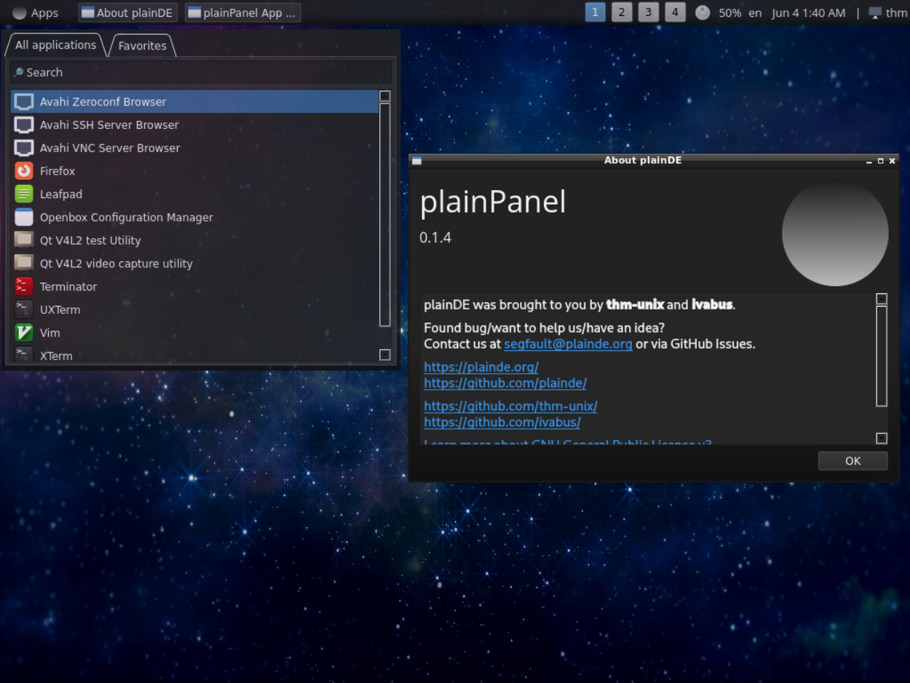

  
  <h1>plainPanel</h1>
  
Lightweight panel for OpenBox, FluxBox and other window managers.

 
  
  
  
  
  <h2>Applets</h2>
   App Menu 
   Window List 
   Spacer 
   Worskpaces 
   Volume 
   Keyboard Layout 
   Date & Time 
   Splitter 
   User menu 
  
  <h2>Screenshots</h2>
  
  
  <h2>Dependencies</h2>
  <code>qt6-base</code>, <code>noto-fonts-emoji</code>, <code>polkit</code>, <code>ttf-opensans</code>, <code>make</code>, <code>alsa-utils</code>, <code>kwindowsystem</code>, <code>python3</code>, <code>xcompmgr</code>
  
  <h2>Installation</h2>
  You can either use <a href="https://github.com/plainDE/plainInstaller">plainInstaller</a>, a script that will download, compile and install everything automatically, or install plainPanel only.  
  
  

    1. <code>git clone https://github.com/plainDE/plainPanel && cd plainPanel</code> 
    2. <code>qmake</code> 
    3. <code>make</code> 
    4. <code>sudo mkdir /usr/share/plainDE && sudo cp ./plainPanel /usr/share/plainDE/</code> 
    5. <code>sudo cp readme-icon.png /usr/share/plainDE/menuIcon.png</code>
  
 
  
  Now add <code>plainPanel</code> to OpenBox/FluxBox/... autostart and enjoy!
  
  <h2>Customizing</h2>
  You can either edit ~/.config/plainDE/config.json manually or use <a href="https://github.com/plainDE/plainControlCenter">plainControlCenter</a>.
  
  <h2>How can I help you?</h2>
  <ul>
    <li>Create a new applet</li>
    <li>Translate plainPanel into another language (soon)</li>
    <li>Fix a bug or suggest solution for it</li>
    <li>Suggest an interesting idea</li>
    <li>...</li>
  </ul>
  
  Any help is appreciated.
  Email us at <a href="mailto:segfault@plainde.org">segfault@plainde.org</a>
  
  <h2>Miscellaneous</h2>
  <b>Note</b>. Mint-Y is recommended icon theme (we use few Mint-Y-only icons). 
  <b>Note</b>. Use setxkbmap to change your keyboard layout.
  

